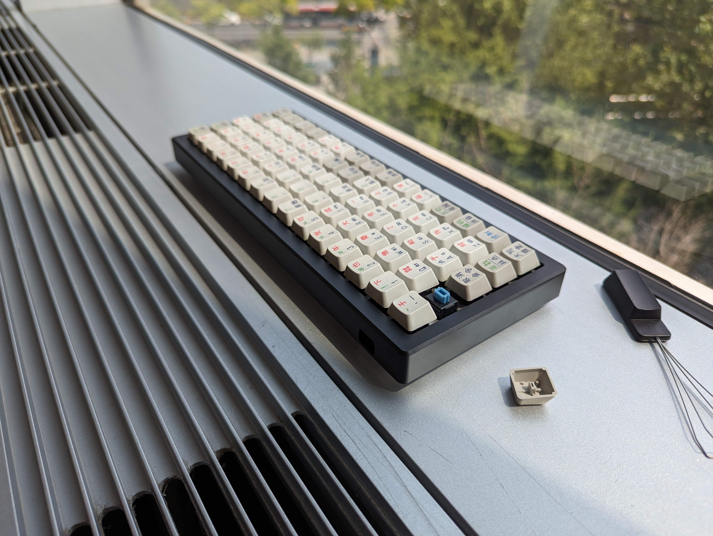
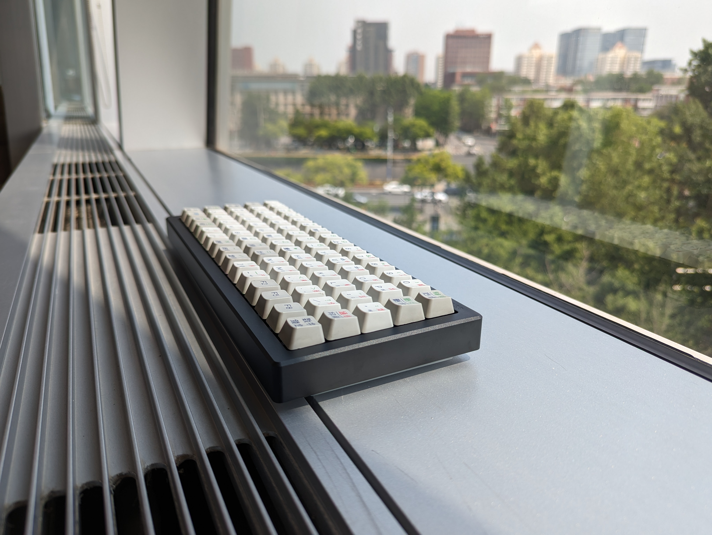
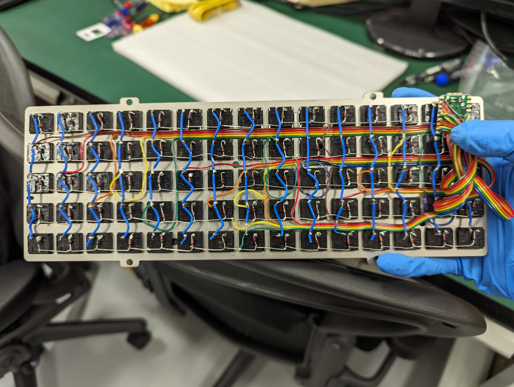
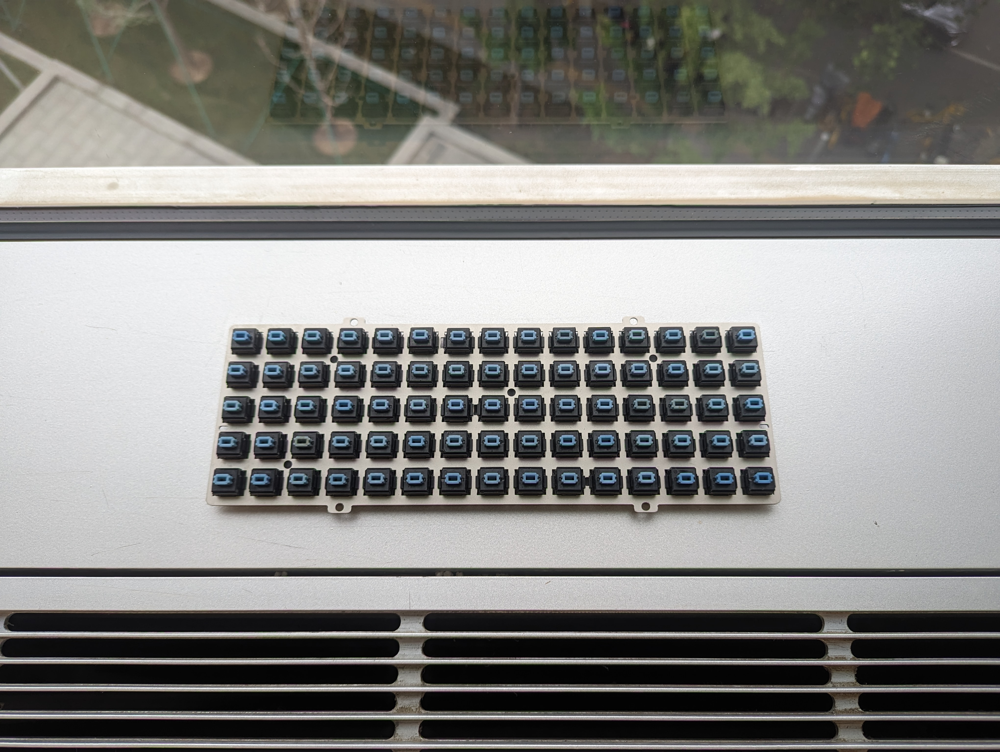
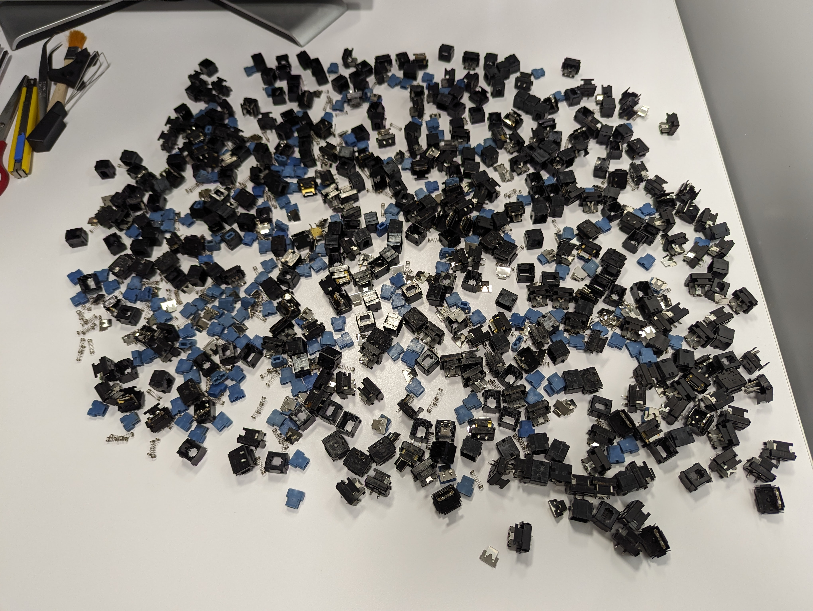
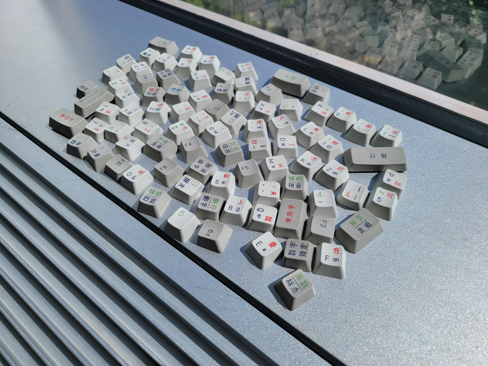
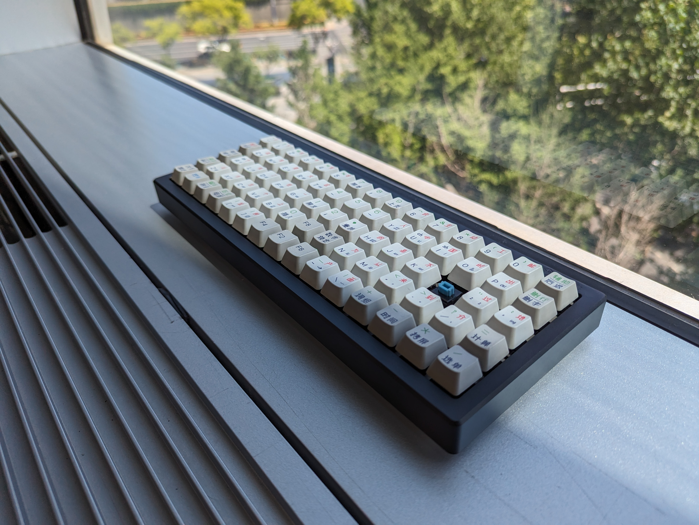

# alps75

Alps 口子軸組的 5×15 直列鍵盤

全 1u 配列

* Keyboard Maintainer: [lotem](https://github.com/lotem)
* Hardware Availability:
  - 從酷品世家店裏買的 xd75 鍵盤外殼和 Alps 定位板
  - 買不到適合 Alps 的 PCB 手工飛綫搞的矩陣
    材料 直插式二極管 單芯銅綫 彩色排綫用於連接到主控 IO
  - 主控要 20 個 IO 我使的是 RP2040
  - 老鍵盤拆機 Alps SKCM 軸體
  - 中文刻印鍵帽拆自四通打字機鍵盤

---

多圖預警

---

Make example for this keyboard (after setting up your build environment):

    make alps75:vial

Flashing example for this keyboard:

    make alps75:vial:flash

See the [build environment setup](https://docs.qmk.fm/#/getting_started_build_tools) and the [make instructions](https://docs.qmk.fm/#/getting_started_make_guide) for more information. Brand new to QMK? Start with our [Complete Newbs Guide](https://docs.qmk.fm/#/newbs).

## Bootloader

Enter the bootloader in 3 ways:

* **Bootmagic reset**: Hold down the key at (0,0) in the matrix (usually the top left key or Escape) and plug in the keyboard
* **Physical reset button**: Briefly press the button on the back of the PCB - some may have pads you must short instead
* **Keycode in layout**: Press the key mapped to `QK_BOOT` if it is available
